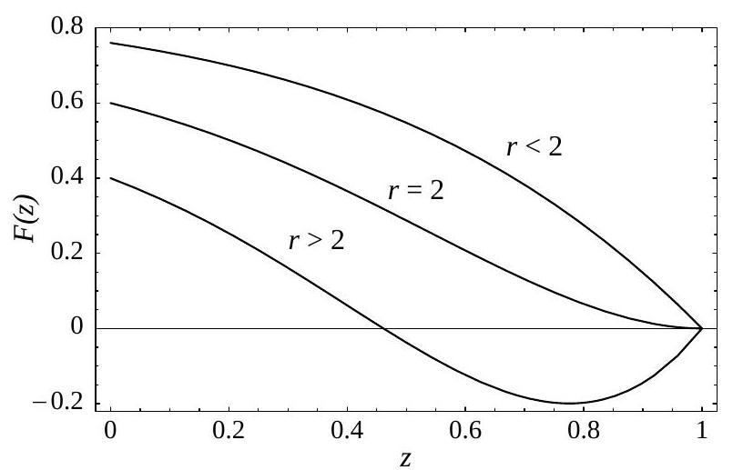

# Replicator Dynamics for Optional Public Good Games
[Public Goods Game](https://www.youtube.com/watch?v=zuNrl-QCCTU)

Public Goods Game (PGG) uses a voluntary contribution mechanism (VCM)

The players are choosing between contributing or not contributing to something considered a public good. Similar to the prisoner's dilema. 

The most logical choice for both evolutionary and traditional game theory is for each person not to contribute (defect), which means nobody puts anything into the public good. 

If we allow people whether or not to participate we will have these strategies:
- cooperate
- not cooperate
- not participate at all

Replicator Dynamics is a method used to study how the strategies evolve over time.   

They found that if there is significant benefits to contributing the strategies go through cycles like rock paper scissors where cooperation, not cooperating and not participating each have turns being more successful which results in higher levels of cooperation in the group.   

No matter which strategy becomes dominant, the average payoff for everyone in the game remains the same as the people who choose not to participate. If cooperation is more common it doesn't mean everyone benefits more than the people who don't contribute. 

## Introduction
Cooperation can emerge from people who are self interested. 
- Kin selection
- Group selection
- Reciprocal altruism

Using Public Goods Game to encourage cooperation:
1. There are 8 players and each player starts with $20 and can choose to put some or all of their money in a common pool
2. Total in pool is tripled and then divided equally among all players, regardless of individual contribution

Even though there is a temptation not to contribute, people often put money in the pool.  
It is observed in the real world where people tend to invest around $10 or more in the first round even though it may seem more rational not to contribute. 

Three types of players in this game:
- "Loners" who choose not to participate and prefer a small fixed payout of $P_1$. 
    - Recives: $P_l = σc$, where σ is a number between 0 and (r-1)
    - Better off than "defectors" but worse off than "cooperators" in a group where everyone cooperates
- "Cooperators" who are willing to join the group and contribute
- "Defectors" who join the group but don't contribute to the common pool

Assuming that people form groups randomly, the payoff for the different strategies depend on how many people follow each strategy.
- $P_c$ payoff for cooperators
- $P_d$ payoff for defectors
- $P_1$ payoff for loners

The payoffs are determined by relative frequencies $x$,$y$,and $z$ of these three types of players in the population. 

## The Model
There is a large population of players who play a game together. 

A random subset of players (group members) are chosen. They can make one of thse choices:
- Cooperate: contribute a fixed amount $c$ to a shared pool
- Defect: don't contribute anything
- Lone player (Loner): don't participate in group game and get a small but fixed payoff of $P_l = σc$.

Payoffs:
- Cooperators: $P_c = -c + rc \frac{n_c}{N}$
    - $-c$ represents the cost incurred by a cooperator for contributing a fixed amount $c$ to the shared pool
    - $rc \frac{n_c}{N}$ is the benefit earned by a cooperator
        - $r$ is the interest rate on the common pool, determines the return on the shared resources
        - $n_c$ is number of cooperators in the group
        - $N$ is total number of players in the group
- Defectors: $P_d = rc \frac{n_c}{N}$
    - $rc \frac{n_c}{N}$ means they get the same benefit as cooperators
    - they don't incur initial cost of c
- Loners: $P_l = σc$ (fixed)-
    - $σc$, where $σ$ is a parameter representing a positive function constrained by $0$ < $σ$ < $r-1$
    - recieves a fixed payoff that is a multiple of fixed contribution c

$r$ : interest rate of shared pool

Constraint: $1 < r < N$ 
- If everyone cooperates, they are btter off than if everyone defects, individual is better off defecting than cooperating

The payoffs $P_c, P_d, and P_l$ are calculated based on the relative frequencies $x$, $y$, and $z$ of people choosing from these three strategies.

Questions:
- What is $0<\sigma<r-1$ ?
    - Says that $\sigma$ must be a positive number and less than r-1
    - $\sigma$ is a positive fraction
    - ex: if $\sigma = 0.5$, it means that loners receive half of the cooperative contribution ($c$) as their fixed payoff
    - $\sigma$ is limited by the value of $r$ ( the interest rate on the common pool)
    - By limiting $\sigma$ to be less than $r-1$, the condition ensures that the fixed payoff for loners ($P_l = \sigma c$) is less than the total return from cooperation (represented with $rc$)
    - Helps loners to recieve a fixed but relatively smaller payoff compared to what cooperators can potentially get through cooperation.

## The Equations of Motion
Payoff determines strategy growth rate in the evolutionary game theory. Players compare payoffs occassionally, adopting strategies based on positive differences.

Continuous time model for strategy frequency evolution: $\dot{x}_{i}=\sum_{j} x_{i} x_{j}\left(P_{i}-P_{j}\right)$  

- **$\dot{x}_{i}$** is rate of change of the frequency of strategy $i$ with respect to time
- **$\sum_{j}$** sum over all possible strategies, where $j$ represents each of the strategies in the population
- **$x_{i}$ and $x_{j}$** frequencies of strategies $i$ and $j$ in the population and denote the proportions of individuals using each strategy
- **$\left(P_{i}-P_{j}\right)$** strategy $i$ and strategy $j$ difference, represents how well $i$ is doing compared to $j$ in terms of payoffs
- Therefore, the equation is saying that the rate of change of the frequency and strategy $i$ is proportional to the sum of the products of the frequecy $i$ and the frequency of each other strategy $j$ multiplied by a difference in payoffs between $i$ and $i$.

Reduces to replicator equation: $\dot{x}_{i}=x_{i}\left(P_{i}-\bar{P}\right)$, where $\bar{P}=\sum x_{j} P_{j}$
- $\dot{x}_{i}$ is the rate of change the frequncy of strategy $i$ changes time, aka how fast the proportions of individuals using strategy $i$ is changing
- $x_{i}$ is the current proportion of individuals using strategy $i$ in the population, representing the fraction of the population employing strategy $i$ at a given moment
- $\left(P_{i}-\bar{P}\right)$ represents the difference between the payoff strategy $i$ ($P_{i}$) and the average payoff of the entire population ($\bar{P}$)

The replicator equation captures how the frequency of a strategy changes over time based on the difference in payoffs.

Cost of cooperation (c) set to 1.   
Payoffs: $P_{l}=\sigma$, $P_{c}$ and $P_{d}$ derived based on cooperation and defection probabilities.
- loner payoff $P_{l}$ , given by  $\sigma$
- Defector $P_{d}$ payoff equation:

Advantage over cooperators depends on loner fraction (z).
Sign of $P_{d}-P_{c}$ determines cooperation vs. defection switch, which one is more advantagous

$F(z)=P_{d}-P_{c}$ used to find roots   
- finding its roots (values of $z$ where $F(z)=0$) is essential for understanding equilibrium conditions

For $r \leqslant 2$, no root; for $r > 2$, one root $\hat{z}$ in $(0,1)$ that represents a specific loner fraction at which cooperators and defectors are in equilibrium

Average payoff ($\bar{P}$) expressed using loner frequency ($z$)
Equation: $\bar{P}=\sigma-[(1-z) \sigma-(r-1) x]\left(1-z^{N-1}\right)$

## The Dynamics

Figure 1:
- Simplex $S_{3}$ represents strategies defined by proportions of cooperators ($x$), defectors ($y$), and loners ($z$), subject to the constraint $x + y + z = 1$. 
- The function $F(z)$ represents the difference between the payoffs of cooperators ($P_c$) and defectors ($P_d$)
- horizontal axis represents the fraction of loners $(z)$ and the vertical axis represents the payoff difference $(F(z))$.
- when nearly everyone participates ($z \rightarrow 0$), $F(z) > 0$, indicates an incentive to defect
- for interest rates $r > 2$, as the proportion of loners ($z$) increases, $F(z) < 0$, signaling an advantage for cooperation and a resolution of the dilema

Figure 1 : the relationship between the fraction of loners, the payoff difference between cooperators and defectors, and how these dynamics impact the strategies in a public goods game

Figure 2
Seems to illustrate a rock-paper-scissors type cycle.
It seems like there is an absense of stable cooperation