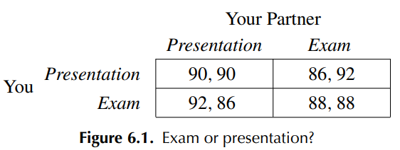
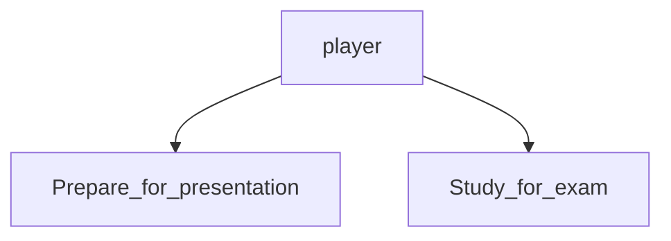
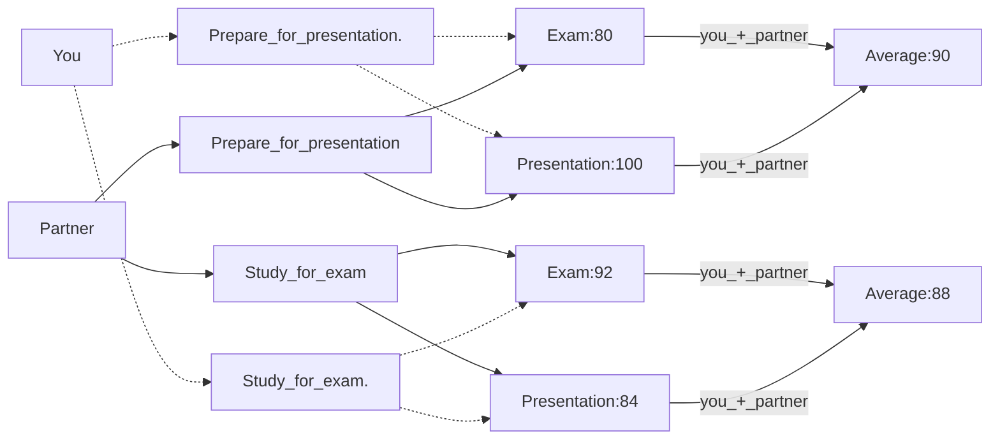
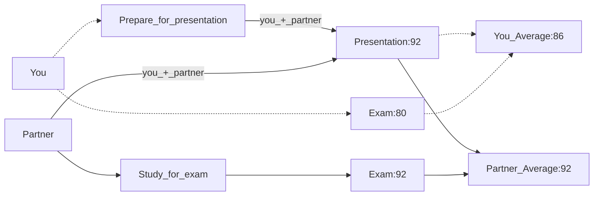

# Chapter 6 Games
The connectedness of a complex system like a social group, nature, or technology means that different parts of the system are liked together. At the same time, the actions of individuals in the system depend on each other so the outcome for one person is influenced by what another person does. Graph theory is mentioned to discuss the structure of the connections. 

TLDR; things in a system affects other things in the system. 

## 6.1 What is a game?

### Example:
Assignments due tomorrow:  
- Presentation
- Exam 

Assumptions:
1. Choose 1 to do
2. The grade estimates are accurate based on what you choose
3. The presentation is to be worked on with a partner

Possible Outcomes:  


### Basic Ingredients of a Game

Players: set of participants  
```python
# Python
players = {"You","Your partner"}
```

For each player, they have options on how to behave (strategies)


**For each choice of strategies, each player recieves a payoff that can depend on the strategies selected by everyone**
###### a less brain intensive way to look at the 2x2 table (for me at least), also chapter had these numbers p141:

Results of both studying for the exam or both preparing the presentation:


One person studies for the exam while the other prepares for the presentation:

In this case, this person benefits from the fact that one of the two of you prepared it.