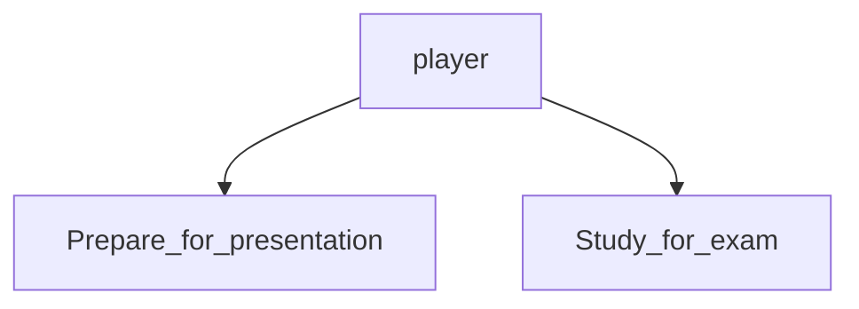
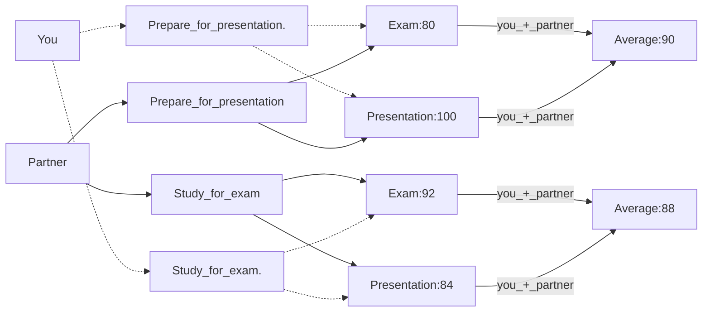
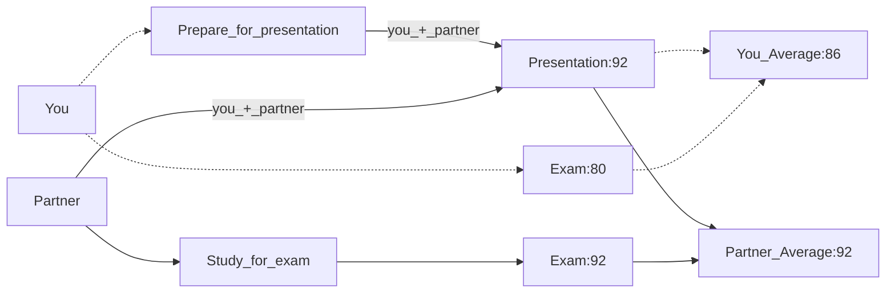
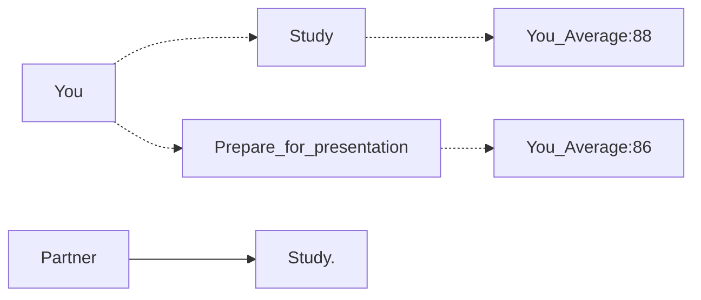
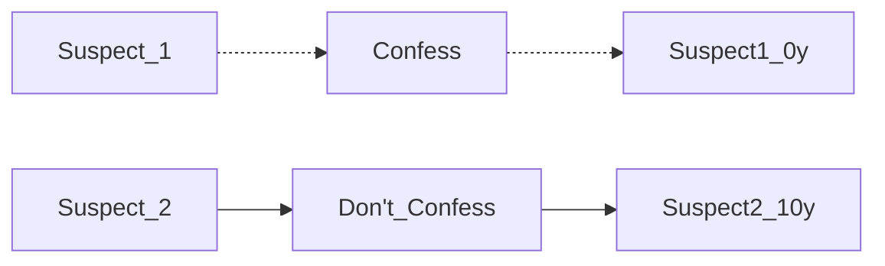
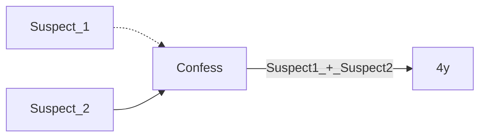
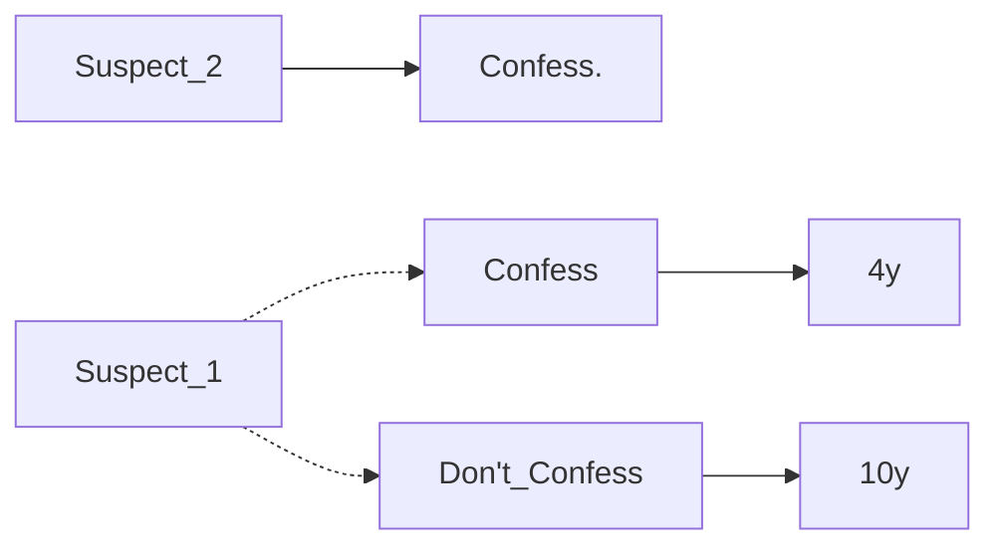
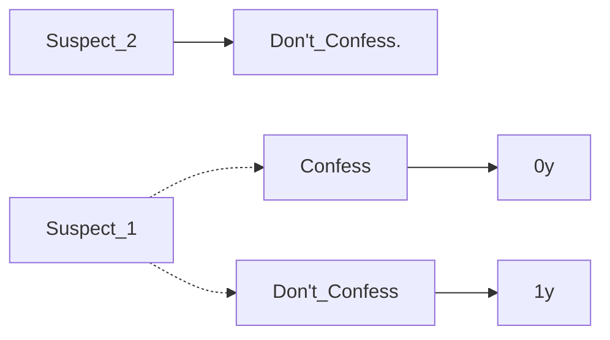
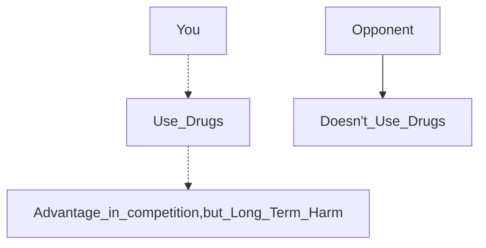

# Chapter 6 Games
The connectedness of a complex system like a social group, nature, or technology means that different parts of the system are liked together. At the same time, the actions of individuals in the system depend on each other so the outcome for one person is influenced by what another person does. Graph theory is mentioned to discuss the structure of the connections. 

TLDR; things in a system affects other things in the system. 

## 6.1 What is a game?

### Example:
Assignments due tomorrow:  
- Presentation
- Exam 

Assumptions:
1. Choose 1 to do
2. The grade estimates are accurate based on what you choose
3. The presentation is to be worked on with a partner

Possible Outcomes:  
Figure 6.1. Exam or presentation?

|         |                | **Your Partner** |        |
|---------|----------------|------------------|--------|
|         |                | _Presentation_   | _Exam_ |
| **You** | _Presentation_ | 90,90            | 86,92  |
|         | _Exam_         | 92,86            | 88,88  |

### Basic Ingredients of a Game

Players: set of participants  
```python
# Python
players = {"You","Your partner"}
```
For each player, they have options on how to behave (strategies)


**For each choice of strategies, each player recieves a payoff that can depend on the strategies selected by everyone**
###### a less brain intensive way to look at the 2x2 table (for me at least), also chapter had these numbers p141:

_Results of both studying for the exam or both preparing the presentation:_


_One person studies for the exam while the other prepares for the presentation:_

In this case, this person benefits from the fact that one of the two of you prepared it.

We learn from this exmaple that you have to consider the strategic consequences of your own actions as well as the effects of others. 

As part of your decision, you have to think about what your partner is likely to do. 

## 6.2 Reasoning about Behavior in a Game
Description of a game consists of players, strategies and payoffs.

A player's behavior is determined by their strategy selection
### Underlying Assumptions
Assumptions:
- Players' preferences are summarized in their payoffs
- Each player knows the game's structure, including strategies available to others and their payoffs
- Each player chooses a strategy to maximize their own payoff based on their beliefs about the other player's strategy

Players aren't required to only care about personal rewards. They can also be altruistic and think about both their own and their partner's benefit. 

Suppose that each individual chooses a strategy to maximize their own payoff given her beliefs about the strategy used by the other player.

Rationality:
- each player wants to maximize their own payoff
- each player actually succeeds in selecting the optimal strategy

In simple settings or with experienced players, the strategy seems reasonable. With complex games or with inexperienced players, it is less reasonable. 

###### This section reminded me of a series of youtube videos i watched with blobs. 
###### [Simulating the Evolution of Aggression - Primer](https://youtu.be/YNMkADpvO4w)
###### The author talked about the choices the blobs made, the impacts and how the changes affect the overall simulation. They had a choice of either being altruistic or consuming more balls to lengthen their survival. 

### Reasoning about Behavior in the Exam-or-Presentation Game

_If you knew your partner was going to study for the exam:_

In this case, you should study for the exam.

_If you knew your partner was going to prepare for the presentation:_

```mermaid
graph LR;
    You -.-> Study
    Study -.-> You_Average:92
    You -.-> Prepare_for_presentation
    Prepare_for_presentation -.-> You_Average:90
    Partner --> Prepare_for_presentation.
``````
In this case, you should also study for the exam.

_If we assume that you and your player only care about maximizing your own grades:_   
Therefore, no matter what your partner does, you should study for the exam.

You have a strategy that is strictly better than all other options regardless of what the other player does, we refer to this as a _strictly dominant strategy_.

We should expect that this player would definitely play this strategy if it is strictly dominant. 

However, if you and your partner could somehow agree that you would both prepare for the presentation, you would each get an average grade of 90 so you would be better off.

This can't be achieved by rational play since each person would still have an incentive to study for the exam to get a boost to 92 because the other person is doing the presentation.

_If you cared about your partner, whether it be:_
- angry partner for not contributing
- you cared about their grade

Then the payoffs and outcome could be different, affecting the results.

**Conclusion:** Even though an average of 90 each is the better outcome for both people it cannot be achieved by rational play.

### A Related Story: The Prisoner's Dilemma
Figure 6.2. Prisoner's Dilema - numbers represent years - lower number is better

|         |                | **Suspect 2** |        |
|---------|----------------|------------------|--------|
|         |                | _NC_   | _C_ |
| **Suspect 1** | _NC_ | -1,-1            | -10,0  |
|         | _C_         | 0,-10            | -4,-4  |

For Suspect 1, they get a higher payout also to confess than not confess. [Left Side]

| NC | -1 | -10 |
|----|----|-----|
| C  | 0  | -4  |

Looking at Suspect 2's options for play, we see that they will be better off confessing than not doing so. [Right Side]

| NC  | C  |
|-----|----|
| -1  | 0  |
| -10 | -4 |

As we can see from this table, even though the best option is to Not Confess (NC) it is not possible to reach this point because the **dominant strategy** for both players is to confess.

Default: Both can be charged with that lesser crime and carry a 1 year sentence
```mermaid
graph LR;
    Suspect_1 -.-> Don't_Confess
    Suspect_2 --> Don't_Confess
    Don't_Confess -->|Suspect1_+_Suspect2| 1y
```

If one person confesses and the other doesn't the one that doesn't will be charged and convicted for 10 years. Therefore the **dominant strategy** for that person is to confess.



Both confess means each will be charged with 4 years.



Suspect_1's reasoning for their options:




The dominant strategy here is to confess regardless of what the other player chooses.  We can see from the table that if we are Suspect 1 for example, if we move to "Not confess" from "Confess" it doesn't mean that Suspect 2 will also move for my benefit. Suspect 2 still has a higher payout from "Confess". **Keep in mind that these are selfish games, players want the best outcome for themselves without considering what's good for both.**

Therefore we should expect both suspects to confess, with a payoff of being convicted for 4 years each. 

This is another outcome where the suspects know the option that is the best for both of them (not confessing for both) but under rational play there's no way for them to achieve this outcome. They end up with an outcome that is worse for both of them. 

Like the exam or presentation example, the payoffs reflect everything and if the suspects threaten each other for confessing and make confessing a less desirable choice this would affect the payoffs and the outcome. 

### Interpretations of the Prisoner's Dilema

The Prisoner's Dilema has been used for many real world situations.

_Athlete 2 payoff is right side, Athlete 1 payoff is left side_  
Figure 6.3 Performance-enhancing drugs - higher number is better
|         |                | **Athlete 2** |        |
|---------|----------------|------------------|--------|
|         |                | Don't Use Drugs   | Use Drugs |
| **Athlete 1** | Don't Use Drugs | 3,3            | 1,4  |
|         | Use Drugs         | 4,1            | 2,2  |


_arms races_ : Situations where two competitors use an increasingly dangerous arsenal of weapons to remain evenly matched



Athlete 1 - Left Side

| Don't Use Drugs | 3 | 1 |
|----|----|-----|
| Use Drugs  | 4  | 2  |

Athlete 2 - Right Side

| Don't Use Drugs  | Use Drugs  |
|-----|----|
| 3  | 4  |
| 1 | 2 |

Looking at the table, the best outcome is to use drugs when your opponent doesn't to maximize your chances of winning (You get a higher score)

Simple changes to a game can change the format from Prisoner's Dilema to something more benign
- Referring back to the exam or presentation game, we keep everything the exact same but the exam be much easier so 100 if you study and 96 if you don't, then the payoff matrix becomes:

Figure 6.4 Exam or Presentation with an easier Exam

|         |                | **Your Partner** |        |
|---------|----------------|------------------|--------|
|         |                | Presentation   | Exam |
| **You** | Presentation | 98,98            | 94,96  |
|         | Exam         | 96,94            | 92,92  |

You - Left Side
| Presentation | 98 | 94 |
|--------------|----|----|
| Exam         | 96 | 92 |

Your Partner - Right Side
| Presentation | Exam |
|--------------|------|
| 98           | 96   |
| 94           | 92   |

With these new payoffs, preparing for the presentation will be the dominant strategy so we can expect both players to play this strategy and both benefit from this decision. The downsides of the previous scenarios no longer appear. 

Choosing presentation gets both people a higher grade.

### Best Responses and Dominant Strategies

Previous Fundimental Concepts:  
**Concept 1**  
- Best response: best choice of one player, given what the other player will do

_S_ : When player 1 chooses a strategy  

_T_ : When player 2 chooses a strategy  

_(S,T)_ : Payoff matrix, a table that shows the outcomes for each combination of strategies  

_P<sub>1</sub>(S,T)_ : Payoff to player 1 as a result of combo of strategies (S,T)

_P<sub>2</sub>(S,T)_ : Payoff to player 2 as a result of combo of strategies (S,T)

_S'_ : For all other strategies of player 1

_P<sub>1</sub>(S,T) &ge; P<sub>1</sub>(S',T)_ : a strategy S for Player 1 is a best response to a strategy T for Player 2 if S
produces at least as good a payoff as any other strategy paired with T

###### There is also a symmetric definition for player 2

Multiple best responses: 
- Player 1 may have multiple strategies that can be considered as best responses to player 2's strategy denoted as T
- These strategies may have the same payoff, making it difficult to predict which one Player 1 will choose

Therefore, to address the ambiguity of multiple best responses, we introduce...

_Strict Best Response_
- Used to identify a strategy that is uniquely the best choice for a player when facing a specific strategy from their opponent

If player 1's S produces a higher payoff than any other strategy paired with T then it is the uniquely best response

_P<sub>1</sub>(S,T) &ge; P<sub>1</sub>(S',T)_

**Concept 2**  
- Strictly Dominant Strategy

Player 1  
_Dominant Strategy_ : a best response to every strategy of Player 2 (Refer to Figure 6.1. Exam or presentation?)

_Strictly Dominant Strategy_ : strict best response for every strategy of Player 2 (Refer to Figure 6.4 Exam or Presentation with an easier Exam)

We can expect player 1 to use a strict dominant strategy if they have that available since dominant strategies depend more on the opponent. 

### A Game in Which Only One Player Has a Strictly Dominant Strategy

Figure 6.5 Marketing Strategy - Higher number is better

|            |             |**Firm 2**     |           |
|------------|-------------|---------------|-----------|
|            |             | **Low-Priced**|**Upscale**| 
|            |**Low-Priced**| .48, .12      | .60, .40  |
|  **Firm 1**|**Upscale**  | .40, .60      | .32, .08  | 


 Assumptions: 
 - People who buy Low-Priced + Upscale can be cleanly split
 - Low priced: 60% of population
 - Upscale: 40% of population

 Firm 1 - more popular
 - Firm 1 - gets 80% sales
 - Firm 2 - gets 20% sales

Firm 1's Payoffs [Left Side]
| Low-Priced | .48 | .60 |
|------------|-----|-----|
| Upscale    | .40 | .32 |

Firm 2's Payoffs [Right Side]
| Low-Priced | Upscale |
|------------|---------|
| .12        | .40     |
| .60        | .08     |

Two firms target low priced segment:  
Low-Priced - .60  
High Priced - .40

Both firms target:
 - Low-Priced: Firm 1 gets 80% (.48) and Firm 2 gets 20% (.12)
 - Upscale: Firm 1 gets (.8)(.4) = .32 and Firm 2 (.2)(.4)= .08

Firm 1 - **Strictly Dominant Strategy**. Low priced [higher number]  
- ##### Strictly Dominant Strategy - the best outcome no matter what the opponent plays.
Firm 2 - No dominant strategy.   
- Low-Priced: Best response when Firm 1 plays Upscale

|                  | Firm 2 - Low Priced |
|------------------|---------------------|
| Firm 1 - Upscale | .40,.60             |

- Upscale: Best response when Firm 1 plays Low-Priced [**Nash Equilibrium**]

|                     | Firm 2 - Upscale |
|---------------------|------------------|
| Firm 1 - Low-Priced | .60,.40          |

- Firm 1 Payoff: .60
-  Firm 2 Payoff: .40  

As shown in the payoff breakdown.

Remember: Firm 1 is always going to pick Low-Priced because it is strictly dominant.

## 6.4 Nash Equilibrium

Nash Equilibrium - When both players have the best option for each of them and any other move would cause them a worse off payoff. (Still Selfish Game so they still only care about their own payoff)

Equilibrium in beliefs. "If each player believes that the other player will actually play a strategy that
is part of a Nash equilibrium, then she has an incentive to play her part of the Nash
equilibrium."

A pair of strategies (S,T), where S is the best response to T and T is the best response to S.

### Example: The Three Client Game.
- Two firms want to do business with one of three clients (A,B,C)

- If both firms pick the same client the payout is cut in half 
- If firm 1 does not pick the same client as firm 2 firm 1 does not get anything because it is a smaller firm. Firm 1 payoff - 0
- If firm 2 picks client B or C alone they will recieve all of the money but if they pick A alone they will not recieve anything because client A is only willing to work with both firms 

Figure 6.6 Three Client Game - Higher number better + remember the firms are selfish

|              |         |**Firm 2**|        |       |
|--------------|---------|----------|--------|-------|
|              |         | **A**    |  **B** |**C**  |
|              |**A**    | 4,4      | 0,2    | 0,2   |
|  **Firm 1**  |**B**    | 0,0      | 1,1    | 0,2   |
|              |**C**    | 0,0      | 0,2    | 1,1   |

Neither firm has a **dominant strategy** each action of 1 firm is a strict best response to a strategy made by another firm. 

Firm 1:
- A is a **strict best response** to Firm 2 choosing A. 

|        | Firm 2 |
|--------|--------|
| Firm 1 | 4,4    |

- B is a **strict best response** to Firm 2 choosing B.

|        | Firm 2 |
|--------|--------|
| Firm 1 | 1,1    |

- C is a **strict best response** to Firm 2 choosing C.

|        | Firm 2 |
|--------|--------|
| Firm 1 | 1,1    |

Firm 2:
- A is a **strict best response** to Firm 1 choosing A.  

|        | Firm 2 |
|--------|--------|
| Firm 1 | 4,4    |

- B is a **strict best response** to Firm 1 choosing C.  

|        | Firm 2 |
|--------|--------|
| Firm 1 | 0,2    |

- C is a **strict best response** to Firm 1 choosing B.

|        | Firm 2 |
|--------|--------|
| Firm 1 | 2,0    |

The **Nash Equilibrium** would be Firm 1 - A, Firm 2 - A. 

|        | Firm 2 |
|--------|--------|
| Firm 1 | 4,4    |

##### If Firm 2 moves to B or C then the payoffs would decrease for Firm 2. Similarly, if Firm 1 moves to B or C then the payoffs would also decrease for Firm 1. They still want their own gains without regard to the other because they are selfish but they are forced to both choose A because of the bigger payout.

## 6.5 Multiple Equilibria: Coordination Game

There can be scenarios where there is more than one point of equilibrium. Which in turn makes it harder to read what action would be done next.

### A Coordination Game

**Coordination Game** - "the two players’ shared goal is really
to coordinate on the same strategy"

The situation of this game is that you and a partner are making a project and you dont know how you should make the presentation. You both only have two choices one being Powerpoint and the other being Keynote. The reason for it being called the coodination game is because you and your partner have the same objective which is to pick the same software. 

Figure 6.8 Unbalanced coordination game 

|         |                | **Your Partner** |        |
|---------|----------------|------------------|--------|
|         |                | Powerpoint       | Keynote|
| **You** | Powerpoint     | 1,1              | 0,0    |
|         | Keynote        | 0,0              | 2,2    |

You have to pick the same software to get any payoff at all. **Nash Equilibrium** for this would be Powerpoint + Powerpoint or Keynote + Keynote.

### Variations of the Basic Coordination Game

- There are different ways that the coordination game can be seen one of them being the unbalanced version but then there is also one called the Battle of Sexes which is When one payoff is higher for you and the other higher for your partner. 
- For instance take it that you want oranges more than grapes but grapes are also a valid choice for you. Youd still be in the equilibrium but not as much as if it was oranges. 

###### Using a different example instead of the one in the writing

figure of my own interpretation of the Battle of Sexes

|         |                | **Your Partner** |        |
|---------|----------------|------------------|--------|
|         |                | oranges          | grapes |
| **You** | oranges        | 2,1              | 0,0    |
|         | grapes         | 0,0              | 1,2    |

##### he forgot to add an explanation when he made his own interpretation so I'm adding it here

Both players recieve higher payoffs for coordinating on (Oranges,Oranges) or (Grapes,Grapes) even though the payoff isn't equal.

- The Final Version of the coordination game is by the Stag hunt game which is when hunter 1 and hunter 2 can either go out together and hunt down a stag, hunter 1 tries to hunt a stag while hunter 2 hunts a hare vice versa and when they both hunt a hare. 
- If the strategies are mismatched, the one who is trying for the higher payoff gets penalized. 

**Pure Strategy Nash Equilibrium** - where each player has chosen a strategy and no player can benefit by changing their strategy while the other players keep theirs unchanged

Figure 6.10 Stag Hunt game

|              |                | **hunter 2**     |         |
|--------------|----------------|------------------|---------|
|              |                | hunt stag        |hunt hare|
| **Hunter 1** | hunt stag      | 4,4              | 0,3     |
|              | hunt hare      | 3,0              | 3,3     |

Two pure strategy Nash equilibria are when both hunters choose to hunt stag (cooperate) or when both hunters choose to hunt hare (defect)

In the stag hunt game both hunters wont have a lower payoff. 

## 6.6 Multiple Equailibria: The Hawk Dove Game 

**Hawk Dove**

In the hawk dove game we are to assume that two animals are thinking of how to split their food. There are two options one is to act like a hawk which is to be aggresive and the other is to be a dove and be passive. The payoffs are as follows: 
- If animal 1 picks hawk and the animal 2 picks dove animal 1's food payoff would be 5 to 1 and vise versa
- If animal 1 picks dove and so does animal 2 they payoff is 3 to 3
- If both animals pick hawk the payoff is 0 to 0 with a posibility of becoming injured which is the pick 

Figure 6.12 Hawk-Dove Game

|            |     | **Animal 2** |        |
|------------|-----|--------------|--------|
|            |     | D            | H      |
|**Animal 1**| D   | 3,3          | 1,5    |
|            | H   | 5,1          | 0,0    |


**After note**

There are two points of nash equilibria one being Dove,Hawk and the other being Hawk,Dove. In most cases one side is going to pick to be agressive while the other tries to find a way to be passive. 
###### this can even be seen in TV shows where one side wants peace while the other wants war. 

(D,H) and (H,D) are Nash Equilibria as neither can improve the payoff by changing their strategy. 

## 6.7 Mixed strategies 

###### this is  what I was waiting for when they over lap

In mixed startegies there can be cases where nash equilibria does not exist. When you allow randomization to be allowed then there is going to be a form of equalibria that can be found according to John Nash's main results. 

### Matching Pennies

The matching pennies game is played by 2 players. Each player recieves one penny. Then they are to pick what their penny will land on (Heads or tails). 
- Player 1 loses their penny to Player 2 if they match 
- Player 1 wins Player 2's penny if they dont match

Figure 6.14 Matching Pennies game

|            |     | **Player 2**    |           |
|------------|-----|-----------------|-----------|
|            |     | H               | T         |
|**Player 1**| H   | -1, +1          | +1, -1    |
|            | T   | +1, -1          | -1, +1    |


**Zero-Sum Game** - A game in which players' interests are in direct conflict. One player's gain is equilvalent to an equivalent loss for another. 

There is no Nash Equilibrium here as the players don't have any advantageous strategy to the other.

### Mixed Strategies
Two players can choose between two options: H or T.
Instead of choosing one option directly, each player chooses the probability of choosing a certain choice. 

Ex: Player 1 chooses a probability of 0.7
- Play H with 70% chance
- Play T with 30% chance

The game has changed since now the players have way more strategies to choose from. 

Strategies for Player 1:
- Numbers _p_ with a probability from 0 to 1
- Player commits to play H with a probability of p and playing T with a probability of 1 - p

Similarly, Strategies for Player 2:
- Numbers q between 0 and 1 representing the probability that Player 2 will play H

This is called "Mixed Strategies" because you are mixing between the options of H and T. 

The original strategies of choosing H or T are still available, but they are called "pure strategies". Choosing H is like choosing a probability of 1 (p = 1, "pure strategy H"), and similarily for p=0 or q = 0 or 1.

### Mixed Strategies Payoffs

Payoffs are now random quantities, with players getting +1 or -1 with some probability.

We use expected **value** to figure out which strategy is better for a player to compare random payoffs. We check how attractive a certain distribution of payoffs is to a player.

Player 1 _pure strategies_:
- definitely playing "H" (heads)
- definitely playing "T" (tails)

Then if we suppose that Player 2 chooses a strategy "q":
- commit to playing "H" with a probability "q"
- playing "T" with a probability 1-q

Here is a payoff chart for this new scenario:
| Player 2 (q) | Player 1 (H) | Player 1 (T) |
|-------------|--------------|--------------|
| q           | 1 - 2q       | 2q - 1       |
| 1 - q       | 1 - 2(1 - q) | 2(1 - q) - 1 |

- _Player 2 (q)_ - represents the probability of Player 2 choosing q
- _Player 1 (H)_ - represents the expected payoff for Player 1 if they choose strategy "H" (heads)

- _Player 1 (T)_ - represents the expected payoff for Player 1 if they choose strategy "T" (tails)

Examples  
Player 2 chooses "q", Player 1 chooses "H":
|   | Player 1 (H) |
|---|--------------|
| q | 1 - 2q       |
-  When evaluating the probability and chances of winning from player 1 with a pure H while player 2 chooses q strategy the payoff is: 
- (−1)(q) + (1)(1 − q) = 1 − 2q

Player 2 chooses "q", and Player 1 chooses "T":
|   | Player 1 (T) |
|---|--------------|
| q | 2q - 1       |
- For the case that player 1 plays a full T strategy when player 2 chooses q the payoff is: 
- (1)(q)+(-1)(1-q) = 2q-1 

Player 2 chooses "1-q", and Player 1 chooses "H":
|       | Player 1 (H) |
|-------|--------------|
| 1 - q | 1 - 2(1 - q) |

Player 2 chooses "1-q" and Player 1 chooses "T":
|       | Player 1 (T) |
|-------|--------------|
| 1 - q | 2(1 - q) - 1 |

Therefore, we can conclude that the payoffs for Player 1 would still be random because of Player 2 choosing a probability. The payoffs depend on the probabilities assigned to each pure strategy.

_expected payoff_ - each player wants to make choices that gives them the highest average payoff
- average outcome they expect to get over multiple rounds of the game after choosing probabilities for each option.
- make decisions to maximize their chances of getting the best result

**Mixed Strategies Version of Matching Pennies game**
Strategies:
- probabilities of picking H
Payoffs: 
- expectations of the payoffs from four outcomes (H,H),(H,T),(T,H),(T,T)
### Equilibrium with Mixed Strategies

No _pure strategy_ can be chosen (choosing H or T with certainty) can be a part of a Nash Equilibrium in the Matching Pennies game since if one player uses a _pure strategy_ the other player can always exploit this by choosing the pure strategy as well so that the first player doesn't have as good of an outcome. 

Player 1's best response to Player 2's strategy q (Probability which Player 2 chooses H):

- Expected payoff to Player 1 for choosing pure strategy H: 1 - 2q
- Expected payoff to Player 1 for choosing pure strategy T: 2q - 1

 if 1 − 2q ≠ 2q − 1, then one of the pure strategies would be the best response for Player 1 to a play of q by Player 2 because one would be larger. 

**Nash Equilibrium** in a Mixed Strategy scenario we must have (1-2q = 2p-1)

Solving for it, we would get q = 1/2.

Therefore, both players must use the mixed strategy with p = 1/2 and q = 1/2 to reach Nash Equilibrium. 

Tldr; the only Nash Equilibrium is when both players randomly choose H and T with equal probabilities.

### Interpreting the Mixed-Strategy Equilibrium for Match Pennies

Two people playing the game of Matching Pennies.
1. Each player commits to behaving randomly with probabilities p and q, respectively
2. if one player believes the other will play Heads (H) strictly more than half the time, they should choose Tails (T). The same thing applies if they believe the other player will choose tails more than half the time
3. In this case, there is _No_ Nash Equilibrium

However, the choice of q = 1/2 by the second player makes the first player indifferent between H and T. q = 1/2 is non-exploitable by the first player, resulting in a Nash Equilibrium

_Indifference_ - In two strategies where there are no equilibria involving pure strategies, each player should randomize their actions to make the other player indifferent between their alternatives so neither player's behavior can be exploited by a pure strategy

In real world situations, this can come off as a tennis player randomly deciding th serve the ball to the center or the side or the court, or a card player deciding to bluff or not.

## 6.8 Mixed Strategies: Examples and Empirical Analysis

|         |      | Defense     |            |
|---------|------|-------------|------------|
|         |      | Defend Pass | Defend Run |
| Offense | Pass | 0,0         | 10,-10     |
|         | Run  | 5,-5        | 0,0        |

Figure 6.15. Run-Pass game

Reminder:  
A mixed strategy equilibrium occurs when each player's randomized strategy makes their opponent indifferent between their own available strategies

The Run-Pass Game illustrates a simplified version of the strategic decisions made by two american football teams during a football game. 
- Payoffs represent the gains or losses in yards

Find the mixed-strategy equilibrium by determine the probabilities at which each player should randomize their actions to make their opponent indifferent.

_p_ : probability that offense chooses to pass
_q_ : probability that the defense chooses to defend against the pass

Ensure the expected payoffs for each player are equal to calculate the probabilities:

**Offense:**
- Payoff from passing: 0 * q + 10 * (1-q) = 10 - 10q
- Payoff from running: 5 * q + 0 * (1-q) = 5q

They should be indifferent between passing and running so set the 2 payoffs equal to each other and solve.
10 - 10q = 5q  
q = 2/3

**Defense:**
- Payoff from defending against the pass: 0 * p - 5 * (1-p) = 5p-5  
- Expected payoff from defending against the run: -10 * p + 0 * (1-p) = -10p

Defense should be indifferent between defensing against the pass and defending against the run, so we set the two expected payoffs equal to each other.
5p - 5 = -10p
p = 1/3

In the mixed-strategy equilibrium, the offense should pass with a probability of 1/3, and the defense should defend against the pass with a probability of 2/3.

Offense will run 2/3 of the time and pass 1/3 of the time.

Defense will defend against the run 1/3 of the time and defend against the pass 2/3 of the time.

Equilibrium payoffs:
- Offense: 10/3
- Defense: -10/3

### Strategic interpretation of the Run-Pass Game
Passing would be the best option for the offense but should only be used 1/3 of the time.

Reason: If offense placed any higher probability on passing then defending the pass would be the defenses best option making passing the worse choice.

As a result, the offense's payoff would decrease to 5/2 which is less than the equilibrium payoff of 10/3 achieved with p = 1/3.

The payoff for playing the pass 1/3 of the time has a higher payoff because using it only 1/3 of the time makes the defense indifferent between its two strategies.

**The Penalty Kick game**

|         |      | Goalie      |            |
|---------|------|-------------|------------|
|         |      | L           | R          |
| Kicker  | L    | 0.58,-0.58  | 0.95,-0.95 |
|         | R    | 0.93, -0.93 | 0.70, -0.70|

Figure 6.16. Penalty-kick games

Penalty-kick game illustrates an analysis of roughly 1400 penalty kicks in professional soccer.

- Payoffs represent the probability of scoring

q: probability of goalie chosing L.

(q is set to make the kicker indifferent between his two options.)
(.58)(q)+(.95)(1-q)=(.93)(q)+(.70)(1-q)

- Solving for q we get q = .42 
- Solving for p we get p = .39

**Finding All Nash Equilibria**

- Note that a game can have both pure-startegy and mixed strategy. 
- This being so one should check for all four pure outcomes. 
- Then next check for mixed equilibria while also looking for mixing probabilities p and q to get the best responses for each other.
- If there is a mixed strategy equilibrium then it can be determined what player 2's strategy will be from what player 1 chooses and vice versa. 

|     |           |Your partner |            |
|-----|-----------|-------------|------------|
|     |           | Powerpoint  | Keynote    |
| You | Powerpoint| 1,1         | 0,0        |
|     | Keynote   | 0,0         |2,2         |

Figure 6.17. Unbalanced coordination game.

Games can have both pure and mixed equilibria in them. The coordination game is an example of this having two pure equilibria also has a third equilibrium being the mixed strategy equilibrium. 

Suppose:
- You place a probability of p strictly between 0 and 1 on Powerpoint
- Your partner places ptobability of q strictly between 0 and 1 on Powerpoint
Then Keynote and Powerpoint will be indifferent.

(equation of probability)
(1)(q)+(0)(1-q) = (0)(q)+(2)(1-q)

- q will then be equal to 2/3 and since the situation is symmetric p will also be 2/3

This mixed equilibrium comes with a positive probability that the two of you will miscoordinate.
- Still and equilibrium because the probability for Powerpoint is 2/3 and keynote is 1/3 making you indifferent between the two.

## Pareto Optimality and Social Optimality 

Pareto optimal: A choice of strategies where no other choice of strategies in which all players recieve payoffs at least as high, and at least one player recieves a strictly high payoff.

Social optimality: A choice of strategies that maximizes the sum of the players.