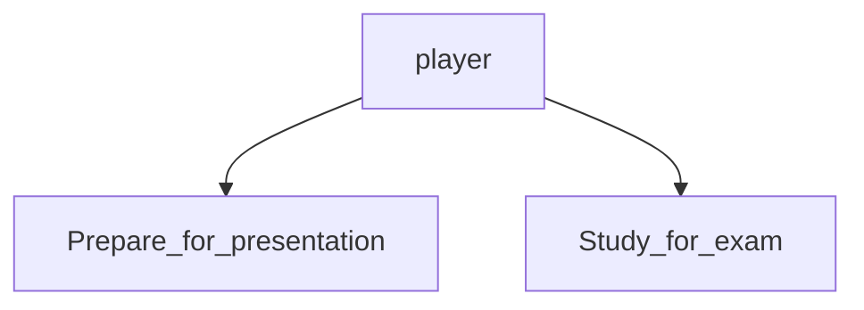
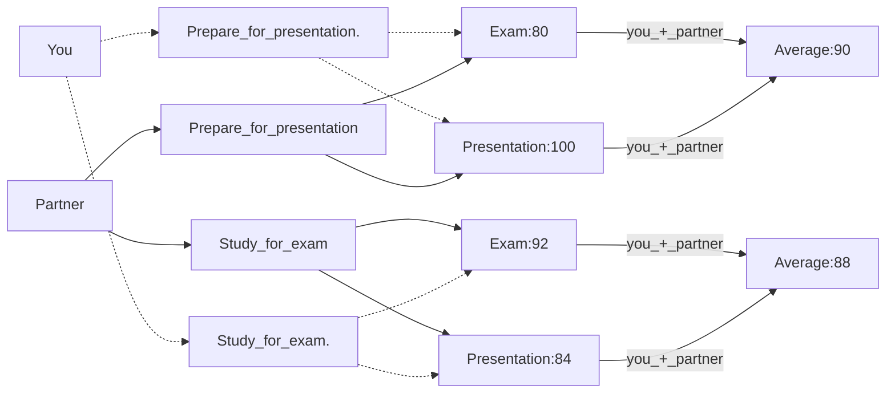
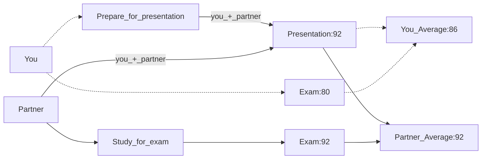

# Chapter 6 Games
The connectedness of a complex system like a social group, nature, or technology means that different parts of the system are liked together. At the same time, the actions of individuals in the system depend on each other so the outcome for one person is influenced by what another person does. Graph theory is mentioned to discuss the structure of the connections. 

TLDR; things in a system affects other things in the system. 

## 6.1 What is a game?

### Example:
Assignments due tomorrow:  
- Presentation
- Exam 

Assumptions:
1. Choose 1 to do
2. The grade estimates are accurate based on what you choose
3. The presentation is to be worked on with a partner

Possible Outcomes:  
Figure 6.1. Exam or presentation?

|         |                | **Your Partner** |        |
|---------|----------------|------------------|--------|
|         |                | _Presentation_   | _Exam_ |
| **You** | _Presentation_ | 90,90            | 86,92  |
|         | _Exam_         | 92,86            | 88,88  |


### Basic Ingredients of a Game

Players: set of participants  
```python
# Python
players = {"You","Your partner"}
```

For each player, they have options on how to behave (strategies)


**For each choice of strategies, each player recieves a payoff that can depend on the strategies selected by everyone**
###### a less brain intensive way to look at the 2x2 table (for me at least), also chapter had these numbers p141:

Results of both studying for the exam or both preparing the presentation:


One person studies for the exam while the other prepares for the presentation:

In this case, this person benefits from the fact that one of the two of you prepared it.

We learn from this exmaple that you have to consider the strategic consequences of your own actions as well as the effects of others. 

As part of your decision, you have to think about what your partner is likely to do. 

## 6.2 Reasoning about Behavior in a Game
Description of a game consists of players, strategies and payoffs.

A player's behavior is determined by their strategy selection

Assumptions:
- Players' preferences are summarized in their payoffs
- Each player knows the game's structure, including strategies available to others and their payoffs
- Each player chooses a strategy to maximize their own payoff based on their beliefs about the other player's strategy

Players aren't required to only care about personal rewards. They can also be altruistic and think about both their own and their partner's benefit. 

Suppose that each individual chooses a trategy to maximize their own payoff given her beliefs about the strategy used by the other player.

Rationality:
- each player wants to maximize their own payoff
- each player actually succeds in selecting the optimal strategy

In simple settings or with experienced players, the strategy seems reasonable. With complex games or with inexperienced players, it is less reasonable. 

----------
Playoffs provide a complete description of each player's evaluation of game outcomes.

Rationality combines the ideas of maximizing individual payoff and selecting the best strategy. 

Rationality in simple games or for experienced players is reasonable and unreasonable in complex games or for inexperienced players. 