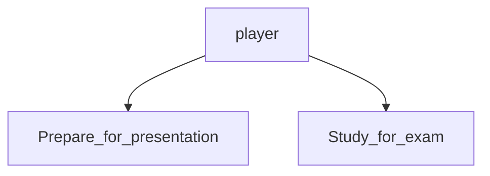
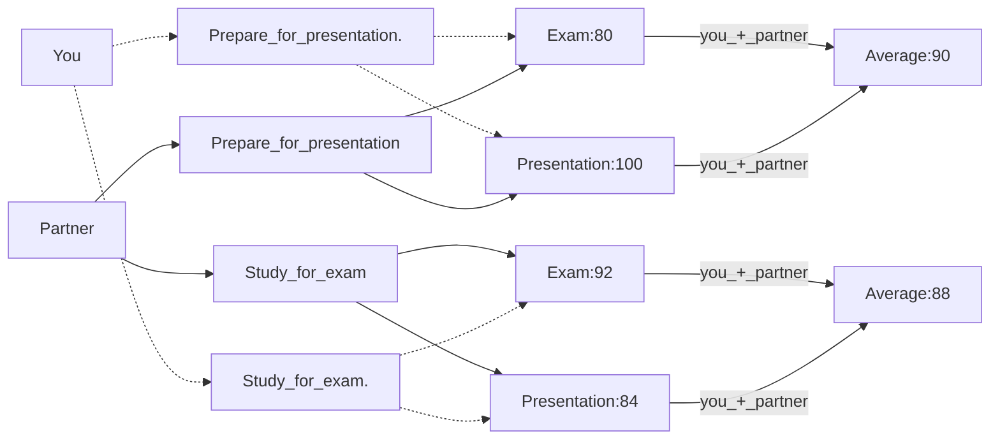
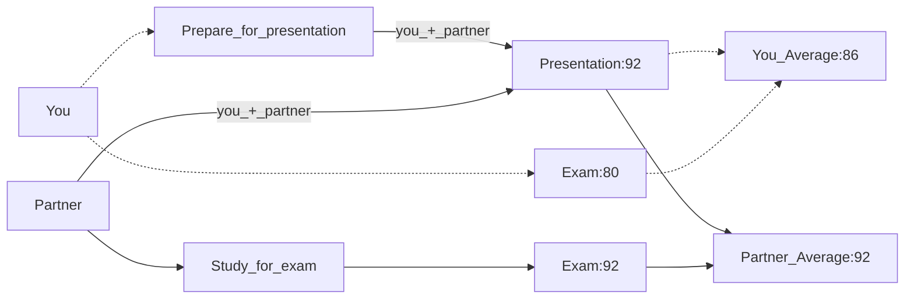
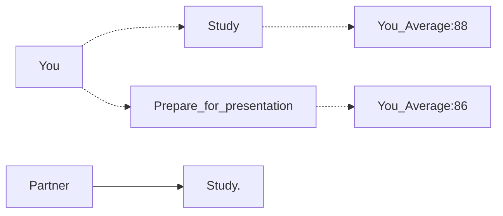
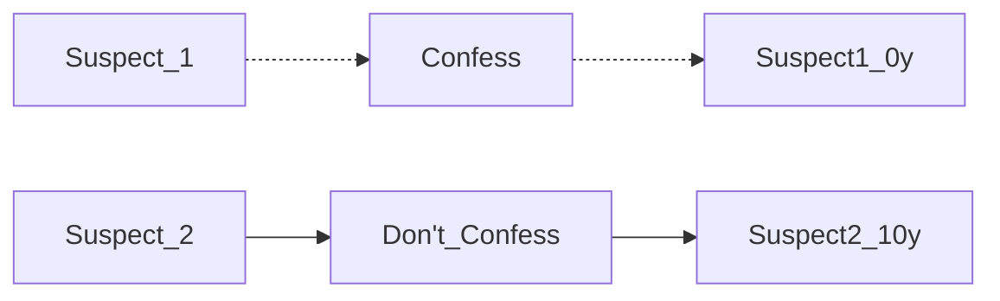
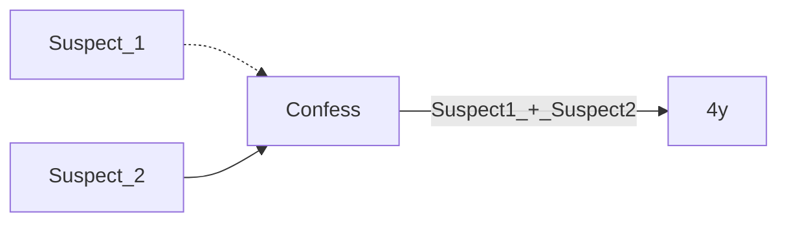
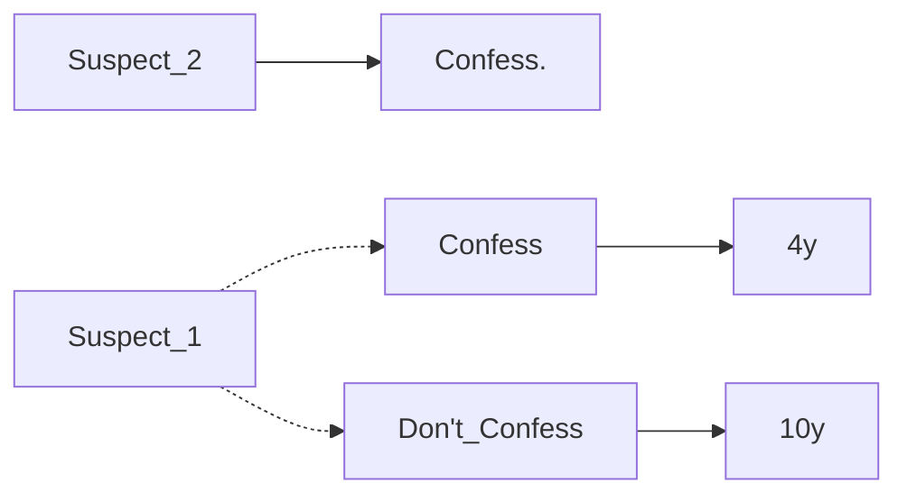
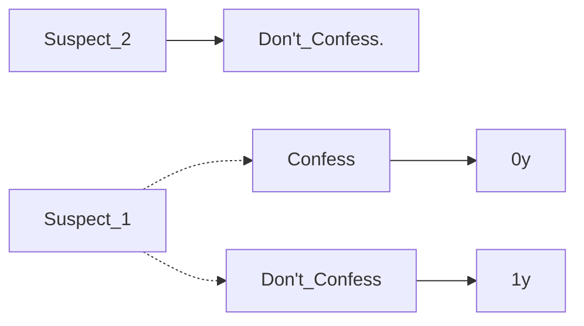
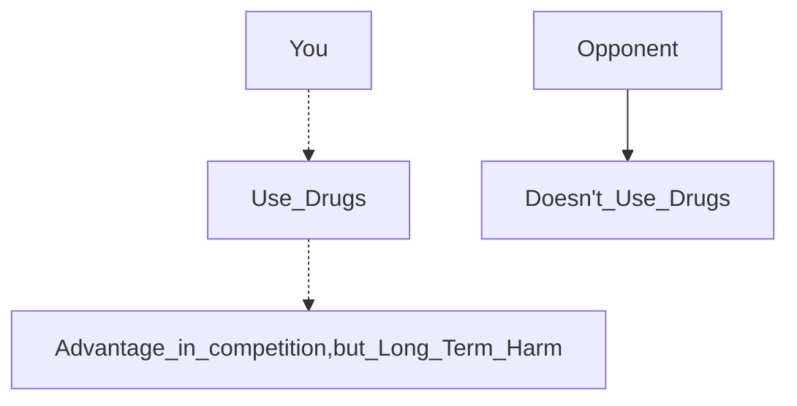

# Chapter 6 Games
The connectedness of a complex system like a social group, nature, or technology means that different parts of the system are liked together. At the same time, the actions of individuals in the system depend on each other so the outcome for one person is influenced by what another person does. Graph theory is mentioned to discuss the structure of the connections. 

TLDR; things in a system affects other things in the system. 

## 6.1 What is a game?

### Example:
Assignments due tomorrow:  
- Presentation
- Exam 

Assumptions:
1. Choose 1 to do
2. The grade estimates are accurate based on what you choose
3. The presentation is to be worked on with a partner

Possible Outcomes:  
Figure 6.1. Exam or presentation?

|         |                | **Your Partner** |        |
|---------|----------------|------------------|--------|
|         |                | _Presentation_   | _Exam_ |
| **You** | _Presentation_ | 90,90            | 86,92  |
|         | _Exam_         | 92,86            | 88,88  |


### Basic Ingredients of a Game

Players: set of participants  
```python
# Python
players = {"You","Your partner"}
```
For each player, they have options on how to behave (strategies)


**For each choice of strategies, each player recieves a payoff that can depend on the strategies selected by everyone**
###### a less brain intensive way to look at the 2x2 table (for me at least), also chapter had these numbers p141:

_Results of both studying for the exam or both preparing the presentation:_


_One person studies for the exam while the other prepares for the presentation:_

In this case, this person benefits from the fact that one of the two of you prepared it.

We learn from this exmaple that you have to consider the strategic consequences of your own actions as well as the effects of others. 

As part of your decision, you have to think about what your partner is likely to do. 

## 6.2 Reasoning about Behavior in a Game
Description of a game consists of players, strategies and payoffs.

A player's behavior is determined by their strategy selection
### Underlying Assumptions
Assumptions:
- Players' preferences are summarized in their payoffs
- Each player knows the game's structure, including strategies available to others and their payoffs
- Each player chooses a strategy to maximize their own payoff based on their beliefs about the other player's strategy

Players aren't required to only care about personal rewards. They can also be altruistic and think about both their own and their partner's benefit. 

Suppose that each individual chooses a strategy to maximize their own payoff given her beliefs about the strategy used by the other player.

Rationality:
- each player wants to maximize their own payoff
- each player actually succeeds in selecting the optimal strategy

In simple settings or with experienced players, the strategy seems reasonable. With complex games or with inexperienced players, it is less reasonable. 

###### This section reminded me of a series of youtube videos i watched with blobs. 
###### [Simulating the Evolution of Aggression - Primer](https://youtu.be/YNMkADpvO4w)
###### The author talked about the choices the blobs made, the impacts and how the changes affect the overall simulation. They had a choice of either being altruistic or consuming more balls to lengthen their survival. 

### Reasoning about Behavior in the Exam-or-Presentation Game

_If you knew your partner was going to study for the exam:_

In this case, you should study for the exam.

_If you knew your partner was going to prepare for the presentation:_

```mermaid
graph LR;
    You -.-> Study
    Study -.-> You_Average:92
    You -.-> Prepare_for_presentation
    Prepare_for_presentation -.-> You_Average:90
    Partner --> Prepare_for_presentation.
``````
In this case, you should also study for the exam.

_If we assume that you and your player only care about maximizing your own grades:_   
Therefore, no matter what your partner does, you should study for the exam.

You have a strategy that is strictly better than all other options regardless of what the other player does, we refer to this as a _strictly dominant strategy_.

We should expect that this player would definitely play this strategy if it is strictly dominant. 

However, if you and your partner could somehow agree that you would both prepare for the presentation, you would each get an average grade of 90 so you would be better off.

This can't be achieved by rational play since each person would still have an incentive to study for the exam to get a boost to 92 because the other person is doing the presentation.

_If you cared about your partner, whether it be:_
- angry partner for not contributing
- you cared about their grade

Then the payoffs and outcome could be different, affecting the results.

**Conclusion:** Even though an average of 90 each is the better outcome for both people it cannot be achieved by rational play.

### A Related Story: The Prisoner's Dilemma
Figure 6.2. Prisoner's Dilema
|         |                | **Suspect 2** |        |
|---------|----------------|------------------|--------|
|         |                | _NC_   | _C_ |
| **Suspect 1** | _NC_ | -1,-1            | -10,0  |
|         | _C_         | 0,-10            | -4,-4  |

Default: Both can be charged with that lesser crime and carry a 1 year sentence
```mermaid
graph LR;
    Suspect_1 -.-> Don't_Confess
    Suspect_2 --> Don't_Confess
    Don't_Confess -->|Suspect1_+_Suspect2| 1y
```

If one person confesses and the other doesn't the one that doesn't will be charged and convicted for 10 years



Both confess means each will be charged with 4 years



Suspect_1's reasoning for their options:




The dominant strategy here is to confess regardless of what the other player chooses.

Therefore we should expect both suspects to confess, with a payoff of being convicted for 4 years each. 

This is another outcome where the suspects know the option that is the best for both of them (not confessing for both) but under rational play there's no way for them to achieve this outcome. They end up with an outcome that is worse for both of them. 

Like the exam or presentation example, the payoffs reflect everything and if the suspects threaten each other for confessing and make confessing a less desirable choice this would affect the payoffs and the outcome. 

### Interpretations of the Prisoner's Dilema

The Prisoner's Dilema has been used for many real world situations.

Figure 6.3 Performance-enhancing drugs
|         |                | **Athlete 2** |        |
|---------|----------------|------------------|--------|
|         |                | Don't Use Drugs   | Use Drugs |
| **Athlete 1** | Don't Use Drugs | 3,3            | 1,4  |
|         | Use Drugs         | 4,1            | 2,2  |

_arms races_ : Situations where two competitors use an increasingly dangerous arsenal of weapons to remain evenly matched

